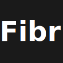

# Fibr - AI-Powered Twitter Content Generator

<p align="center">
  
</p>

<p align="center">
  <strong>Transform any webpage into professional Twitter content with AI assistance</strong>
</p>

<p align="center">
  
  
  
</p>

## ✨ What is Fibr?

**Fibr** is a cutting-edge Chrome extension that revolutionizes how you create Twitter content. Using advanced AI powered by Google's Gemini 2.0 Flash API, Fibr automatically analyzes any webpage and generates:

- **🎯 Single Tweets** - Perfect 280-character posts
- **🧵 Twitter Threads** - Multi-part stories with numbered cards
- **📊 Content Analysis** - Summaries, key points, FAQs, and fact-checking
- **💬 AI Chat** - Interactive conversations about any content
- **📝 Smart Formatting** - Professional content with proper hashtags and mentions

Transform lengthy articles, blog posts, or research into engaging Twitter content in seconds. No more struggling with character limits or boring content!

## 🚀 Key Features

### 🎨 **Beautiful Glassmorphism UI**
- Modern frosted glass design with backdrop blur effects
- Smooth dark/light mode toggle
- Responsive design that adapts to any screen size
- Intuitive navigation with horizontal scrolling action bar

### 🤖 **Advanced AI Content Generation**
- **Twitter Posts**: Generate single tweets with character counting
- **Twitter Threads**: Create numbered thread cards with copy functionality
- **Content Analysis**: 8 analysis types including summaries, key points, FAQs, and fact-checking
- **Smart Length Control**: Interactive slider (50-2000 characters) with presets
- **Unicode-Aware**: Proper emoji and special character handling

### 💡 **Intelligent Features**
- **Demo Mode**: Full functionality without API key for testing
- **Character Counter**: Real-time counting with emoji support
- **Content Sanitization**: Removes AI artifacts and formatting noise
- **Auto-Resize Text Areas**: Smart containers that adapt to content
- **Progress Indicators**: Visual feedback during AI processing

### 🔧 **Professional Tools**
- **Quick Actions**: One-click generation for Twitter, Blog, Summary, and Analysis
- **Individual Card Copy**: Copy each tweet or thread card separately
- **Regenerate Options**: Refine content with different length settings
- **Export Functionality**: Save conversations and content
- **Settings Management**: Persistent preferences and API key storage

## 📸 Screenshots

*Coming soon - Screenshots of the beautiful Fibr interface showing Twitter content generation, thread creation, and AI analysis features.*

## 🛠️ Installation

### From Source Code (Development)
1. **Clone the Repository**
   ```bash
   git clone https://github.com/Ravinder82/Fibr-4-Tweeter.git
   cd Fibr-4-Tweeter
   ```

2. **Build the Extension**
   ```bash
   npm install
   npm run build:extension
   ```

3. **Load in Chrome**
   - Open Chrome → `chrome://extensions/`
   - Enable "Developer mode" (toggle in top right)
   - Click "Load unpacked" → Select `dist/extension/` folder

### From Chrome Web Store (Coming Soon)
*Extension submission in progress*

## ⚙️ Setup & Configuration

### 1. **Get Your Gemini API Key**
Fibr requires a free Google Gemini API key to function. Get yours at:
👉 **[Google AI Studio](https://aistudio.google.com/app/apikey)**

### 2. **Configure the Extension**
- Click the Fibr extension icon in your browser toolbar
- Follow the setup wizard or click "API Key Setup"
- Enter your Gemini API key
- Test the connection

### 3. **Start Creating Content**
- Navigate to any webpage with interesting content
- Click the Fibr extension icon
- Choose your desired action (Twitter, Summary, Analysis, etc.)
- Let AI work its magic!

## 🎯 How to Use

### Basic Twitter Content Generation
1. **Open any webpage** with content you want to tweet about
2. **Click the Fibr extension icon**
3. **Select "Twitter"** from the quick actions
4. **Adjust length** using the slider (50-2000 characters)
5. **Copy individual tweets** or the entire thread

### Content Analysis
Choose from 8 analysis types:
- **📄 Summary** - Concise content overview
- **🎯 Key Points** - Actionable bullet points
- **🔍 Analysis** - Deep insights and implications
- **❓ FAQ** - Question and answer generation
- **✅ Fact Check** - Accuracy verification
- **⚖️ Pros & Cons** - Balanced perspectives
- **📅 Timeline** - Chronological information
- **💬 Key Quotes** - Important passages

### AI Chat Interface
- Ask questions about any webpage content
- Get explanations and clarifications
- Interactive markdown-formatted responses
- Conversation history with timestamps

### Advanced Features
- **Thread Library**: Save and organize your best threads
- **Content Optimization**: AI-powered content improvement suggestions
- **Multi-platform**: Generate content for Twitter, LinkedIn, Blog, and Email
- **Export Options**: JSON and PDF export for conversations

## 🎨 UI Navigation

### Main Interface
- **Header**: Logo, dark mode toggle, menu button
- **Quick Actions Bar**: Horizontal scrolling buttons for different actions
- **Content Area**: Dynamic views for generation results
- **Footer**: Status indicators and action buttons

### Navigation Elements
- **Dark Mode Toggle**: Moon/sun icon for theme switching
- **Menu Button**: Hamburger menu for settings and options
  - Gemini API Setup: Update your API key
  - Clear Chat: Reset conversation history
  - Settings: Customize extension behavior
- **Back Button**: Return to previous screens

### Interactive Components
- **Progress Bars**: Animated indicators during AI processing
- **Character Counters**: Real-time Twitter limit tracking
- **Length Sliders**: Adjustable content length controls
- **Copy Buttons**: One-click content copying
- **Regenerate Buttons**: Quick content refinement

## 🔧 Technical Details

### Built With
- **Manifest V3**: Latest Chrome extension standard
- **Vanilla JavaScript**: No frameworks, maximum performance
- **CSS3 with Glassmorphism**: Modern UI with backdrop-filter effects
- **Google Gemini 2.0 Flash API**: Advanced AI model for content generation
- **Chrome Storage API**: Secure local storage for settings
- **Modular Architecture**: Separate modules for enhanced maintainability

### Architecture
- **Service Worker**: Background processing for API communication
- **Content Scripts**: Intelligent webpage content extraction
- **Modular Design**: Separate modules for API, UI, Twitter, analysis, and more
- **Progressive Enhancement**: Graceful degradation for older browsers

### Browser Compatibility
- **Chrome 88+**: Full feature support
- **Chromium-based browsers**: Edge, Brave, Opera, Vivaldi

### Key Technologies
- **Unicode Processing**: Proper emoji and special character handling
- **Responsive Design**: Adapts to any popup/container size
- **Async/Await**: Modern JavaScript for smooth user experience
- **CSS Custom Properties**: Dynamic theming and dark mode support

## 🔐 Privacy & Security

- **Local Storage Only**: API keys stored securely in Chrome's local storage
- **Zero Data Collection**: No personal data collected, stored, or transmitted
- **Direct API Communication**: All requests go directly to Google's Gemini API
- **No Third-Party Tracking**: No analytics, tracking, or external services
- **Open Source**: Complete code transparency and community auditing
- **Minimal Permissions**: Only required permissions (activeTab, storage, scripting)

## 📁 Project Structure

```
Fibr-4-Tweeter/
├── dist/
│   └── extension/              # Production extension files
│       ├── manifest.json       # Chrome extension manifest (V3)
│       ├── popup.html         # Extension popup interface
│       ├── popup.js           # Main popup functionality
│       ├── popup.css          # Glassmorphism styling
│       ├── background.js      # Service worker for API calls
│       ├── content.js         # Content extraction script
│       ├── api.js            # Gemini API integration
│       ├── twitter.js        # Twitter content generation
│       ├── export.js         # Export functionality
│       ├── storage.js         # Storage management
│       ├── ui-render.js      # UI rendering components
│       ├── scroll.js         # Horizontal scrolling
│       ├── navigation.js     # View navigation
│       ├── thread-library.js # Thread management
│       ├── character-counter.js # Unicode-aware counting
│       ├── length-control.js # Content length controls
│       ├── content-analysis.js # AI analysis features
│       ├── demo-mode.js      # Demo functionality
│       ├── auto-resize.js    # Smart text areas
│       ├── progress-bars.js  # Progress indicators
│       └── icons/            # Extension icons
├── src/
│   └── extension/             # Source code
│       ├── modules/          # Modular components
│       ├── popup.html       # Source HTML
│       ├── popup.js         # Source JavaScript
│       └── manifest.json    # Source manifest
├── icons/                     # Extension icons (16, 32, 48, 128px)
├── scripts/                   # Build scripts
├── tests/                     # Test files
├── README.md                  # Project documentation
├── package.json              # Dependencies and scripts
└── manifest.json             # Root manifest
```

## 🚀 Development

### Prerequisites
- Node.js 16+
- Google Chrome or Chromium browser
- Free Google Gemini API key

### Local Development
1. **Clone Repository**
   ```bash
   git clone https://github.com/Ravinder82/Fibr-4-Tweeter.git
   cd Fibr-4-Tweeter
   ```

2. **Install Dependencies**
   ```bash
   npm install
   ```

3. **Development Workflow**
   ```bash
   # Edit files in src/extension/
   npm run build:extension   # Builds to dist/extension/
   # Reload extension in chrome://extensions/
   ```

4. **Testing**
   ```bash
   npm test  # Run test suite
   ```

## ⚠️ Limitations & Known Issues

- **API Key Required**: Free Gemini API key needed for full functionality
- **Chrome Only**: Currently supports Chrome and Chromium-based browsers
- **Rate Limits**: Subject to Google's API rate limits (15 requests/minute, 1500/day)
- **Content Length**: Very long pages may be truncated for API context limits
- **Protected Sites**: Some websites may block content extraction due to CORS policies

## 🔧 Troubleshooting

### Common Issues

**Extension popup not opening or cut off**
- Ensure using `dist/extension/` folder, not root directory
- Check `manifest.json` has proper popup dimensions
- Clear browser cache and reload extension

**"API request failed" error**
- Verify Gemini API key is correct and active
- Check quota at [Google AI Studio](https://aistudio.google.com/app/apikey)
- Wait if rate limited (15 requests/minute limit)

**"Cannot extract content"**
- Some websites block automated extraction
- Try refreshing page and clicking extension again
- Check if site requires login or has anti-bot protection

**Twitter generation issues**
- Ensure content is properly formatted
- Check character limits (50-2000 characters)
- Try different length settings

### Development Issues

**Extension not loading in developer mode**
- Verify `manifest.json` syntax is correct
- Check browser console for JavaScript errors
- Ensure all required files present in `dist/extension/`

## 🤝 Contributing

Contributions welcome! Priority areas:
- **Enhanced Content Extraction**: Better parsing for complex websites
- **Additional AI Models**: Support for other AI providers
- **UI/UX Improvements**: Accessibility and user experience enhancements
- **Testing**: Comprehensive unit and integration tests
- **Documentation**: Examples and tutorials

### Development Guidelines
- Follow existing code style and modular structure
- Test on multiple websites before submitting
- Maintain glassmorphism design consistency
- Ensure accessibility standards compliance
- Update documentation for new features

## 📄 License

This project is licensed under the MIT License - see the [LICENSE](LICENSE) file for details.

## 🆘 Support & Community

For help and support:

1. **Check Documentation**: Review this README and development files
2. **Common Issues**: See troubleshooting section above
3. **API Issues**: Visit [Google AI Studio documentation](https://ai.google.dev/docs)
4. **Report Bugs**: Open an issue in the project repository
5. **Feature Requests**: Submit detailed proposals in issues

### Quick Links
- [Google Gemini API Documentation](https://ai.google.dev/docs)
- [Chrome Extension Developer Guide](https://developer.chrome.com/docs/extensions/mv3/)
- [Fibr GitHub Repository](https://github.com/Ravinder82/Fibr-4-Tweeter)

---

**🚀 Ready to revolutionize your Twitter content creation?** [Get your free Gemini API key](https://aistudio.google.com/app/apikey) and start creating professional Twitter threads with Fibr!

*Built with ❤️ for content creators, marketers, and social media professionals.*
